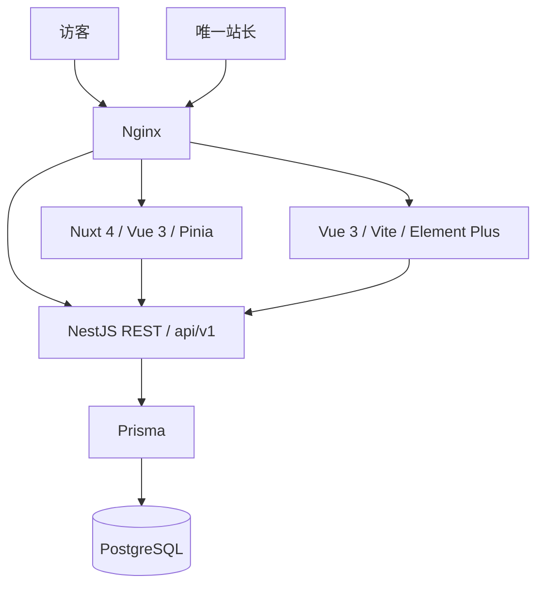

# 架构与分阶段交付

## 边界

采用 npm workspace，当前实现 `apps/backend`；Phase 2 新建 `apps/blog`，Phase 3 新建 `apps/admin`。不提前引入任务编排框架和共享 UI 包。通过 OpenAPI 生成前端类型，不把 Prisma 数据库模型直接导入前端。

后台只有一个站长账户，所有其他人都是访客。数据库唯一表达式索引保证最多一个账户。没有注册、角色矩阵、多租户、扩展系统、主题商店或插件市场。

## 内容模型

当前 migration 包含 users、posts、categories、tags、post_categories、post_tags、site_settings。文章存 Markdown source，content_format 受数据库约束只能是 markdown。数据库列 snake_case，JSON/TypeScript 属性 camelCase，时间使用 UTC timestamptz 和 ISO 8601。

- `slug` 是唯一且稳定的 URL 标识；Phase 1 允许编辑，未来 SEO 阶段再加旧 slug 重定向记录。
- `DRAFT / PUBLISHED / ARCHIVED`；只有 PUBLISHED 且 publishedAt <= 当前时间才公开。未来时间通过查询过滤自然生效，没有定时队列。所有公开发现入口使用同一过滤规则。
- publishedAt 未指定的首次发布使用当前时间；撤回不自动清掉时间，再发布保留原日期。显式传 null 并发布会重置为当前时间。
- PUT 为字段更新语义：省略字段保持不变；coverUrl 和 publishedAt 可显式清空；分类/标签传空数组清空关联。OpenAPI 提供请求定义。
- 数据库事务保证文章和分类/标签替换一起成功或回滚。唯一 slug 冲突返回 409，缺失资源 404，非法关联 400。
- 详情返回 Markdown；列表不返回全文。作者信息仅公开 id、displayName、avatarUrl。email 和 passwordHash 不出现在文章响应。
- viewCount/commentCount 先保留为 0；后续实现去重计数与审核通过评论计数，不把页面请求数当阅读人数。
- site_settings 以 JSONB 保存，`site`、`homepage`、`social` 是公开命名空间，禁止存秘密；其它键不通过公开 API 暴露。Sakura 前端解释 homepage 值，后端没有 Theme 实体。

后续按功能迁移添加 pages、media、comments。评论需审核状态与限流；媒体记录存储键、类型、大小、摘要和上传时间，存储凭据使用服务端环境变量。瞬间、图库、友链采用独立 moments、photos、links 内容模型，避免把大量可分页内容塞入配置 JSON。

## API 约定

公开：`GET /api/v1/public/{site,config,posts,posts/:slug,categories,tags,archives,search}`。

后台：`POST /api/v1/admin/auth/login`、`GET /api/v1/admin/auth/me`，及 `/api/v1/admin/posts` 的 GET/POST、`/:id` 的 GET/PUT/DELETE。

列表返回 `{items,total,page,pageSize}`，page >= 1，pageSize 默认 10、最大 50。列表支持 category/tag slug，search 与 posts 的 q 在标题/摘要上做大小写不敏感匹配；全文检索留待 Phase 4。archives 返回分页的标题/slug/发布时间，按月份分组由前端完成。分类/标签公开列表只含有公开文章的条目，管理 CRUD 后续实现。

JSON 请求体上限 1MB。Nest ValidationPipe 拒绝未知字段。JWT 使用 HS256，固定 issuer/audience、一小时期限。密码使用随机盐与 Node scrypt。无默认凭证，初始化要求显式设置。站长登录限流；当前限流状态在进程内，单实例部署。后续扩容时再引入 Redis。Nginx 不向应用转发客户端自定义的可信身份。

## Phase 2：忠实迁移 Sakura

源码：[LIlGG/halo-theme-sakura](https://github.com/LIlGG/halo-theme-sakura)。调研时 HEAD 为 `a31ff6520b34e45beab20ef91204f958dcf1cd81`，仓库标注 MIT。实施迁移时固定并保存源码版本、LICENSE、第三方资源授权清单；仓库许可不代表所有远程图片/字体可自由再分发。

1. 保存原模板、CSS、SVG、图片、字体、动画和响应式规则；逐项查找外链并本地化，不能只按截图重画。
2. 迁移 DOM 层级/class/variables/breakpoints。将 th:text/each/if/href 转成 Vue 数据绑定。保留原视觉，不使用 Tailwind 重写。
3. 将 Pjax 导航替换为 Nuxt Router；原 JS 的 DOM 行为转换为有清理函数的 composable，在 mounted 初始化、unmounted 注销监听。window/document 仅客户端访问。
4. 首先交付首页 Hero、头像、glitch、wave、文章列表，以及文章 Cover、metadata、Markdown、TOC、tags、author、share。
5. Markdown 默认禁用原始 HTML，经过安全渲染、URL 协议过滤；代码高亮本地依赖。编辑器预览与博客使用一致渲染策略。Mermaid 后续独立安全评估和懒加载。
6. 对照原主题进行桌面/移动端截图验收，检查图片/字体请求不访问 CDN，并测试 SPA 路由切换后动画和监听不重复。

Nuxt `ssr:false`，读取内容使用 useAsyncData/useFetch 与 runtimeConfig。服务端 API 地址和 public API 地址分离，不将秘密放到 public config。不在模块顶层访问浏览器对象。未来开启 SSR 时增加 hydration、服务端请求地址、SEO、sitemap、OpenGraph 和 metadata 测试。

所有路由：`/`、`/posts/:slug`、`/archives`、`/categories`、`/tags`、`/moments`、`/photos`、`/links`、`/search`。非首批页面随对应内容能力交付。

## Phase 3：独立管理端

Vue 3 + Vite + Element Plus，路由基址 `/admin/`。登录、Markdown 编辑、预览、发布/撤回。管理端不加载 Sakura 展示 CSS；从原主题提取主色、圆角、间距、字体和图标规则作为独立设计 token。保持 Halo 式内容工作台结构。Token 第一版仅存内存，刷新后重新登录，后续需要持久会话时再设计 HttpOnly Cookie + CSRF。

## Phase 4：内容完善

媒体上传、分类/标签编辑、搜索增强、评论审核、网站配置及其它博客页面。Redis/BullMQ/S3 仅在这些能力确实需要时加入；当前无空转服务或未实现 endpoint。图库和媒体区分：media 是存储对象，photos 是有标题、描述、排序的展示内容。

## 运维和依赖决策

遵循 finance_analysis 的 Compose + .env + Linux + deploy.sh 方式，增加健康检查、migration gate 和备份。当前生产只运行 database/backend/proxy，blog/admin 随各自阶段加入 Compose，避免用空占位镜像伪装实现。

运行版本锁在 package-lock.json。Prisma 选用 7.x 稳定线，不跟随当前 latest 的 8.x RC。deepmerge-ts/mysql2/js-yaml overrides 修复当前间接依赖审计问题；升级 Prisma/Swagger 时检查是否可以移除 overrides，migration、generate、构建及真实数据库测试必须通过。
