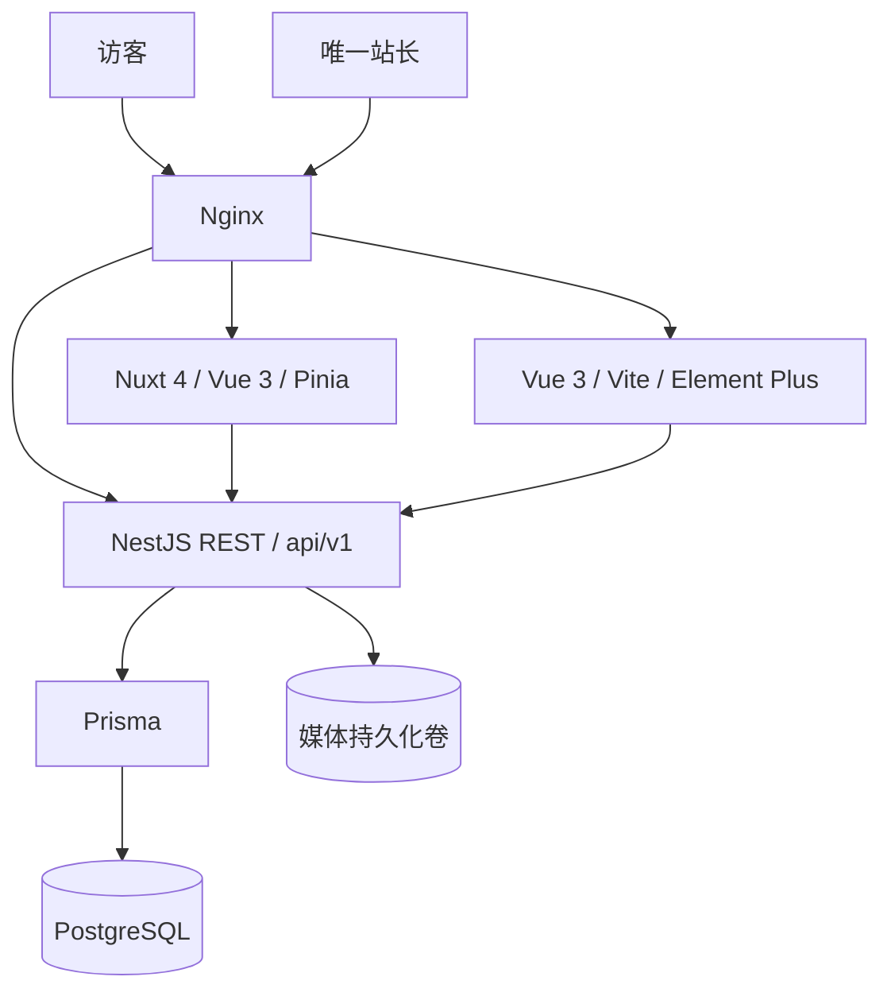

# 架构与实现边界

## 工程与边界

npm workspaces：`apps/backend`、`apps/blog`、`apps/admin`；`packages/content` 提供前端共用的 TypeScript 响应类型、安全 Markdown 渲染和日期格式。前端不导入 Prisma；Swagger 提供请求契约，当前响应类型手工维护并通过集成测试核对主流程。

后台只有一个站长账户，数据库唯一表达式索引保证最多一个账户。没有注册、角色矩阵、多租户、扩展系统或主题商店。后端不依赖 Sakura，不存页面 HTML；`site_settings` 的 JSONB 配置由前端决定如何展示。

## 数据与发布

表包括 users、posts、pages、categories、tags、post_categories、post_tags、media、comments、site_settings、moments、photos、links。数据库列 snake_case，JSON/TS 属性 camelCase；时间以 UTC timestamptz/ISO 8601 传输，博客日期按 Asia/Shanghai 展示。

- 文章、独立页面和瞬间保存 Markdown 原文；渲染在前端运行时完成。
- `DRAFT / PUBLISHED / ARCHIVED`；公开查询仅允许 PUBLISHED 且 publishedAt <= 当前时间。预约发布通过查询过滤生效，无需队列。
- 首次发布自动填时间；撤回保留原时间，再发布继续使用。显式清空时间并发布会设为当前时间。
- 文章 PUT 支持字段更新：省略保持不变，null 清空封面/发布时间，空数组清空分类/标签。内容关联在事务中更新，非法关联回滚。
- slug 唯一，可编辑；当前不提供旧 slug 重定向。SEO 阶段再增加重定向记录。
- 列表不返回正文；作者公开字段仅 id/displayName/avatarUrl。密码哈希与邮箱不出现在公开文章中。
- viewCount 保留字段，暂不采集阅读量；commentCount 随审核事务维护，只计通过审核的评论。
- `site`、`homepage`、`social` 是公开配置命名空间，使用嵌套 DTO 校验；禁止在配置中存秘密。它们不构成后端主题实体。
- media 是存储对象；photos 是有标题、描述、相册与公开开关的图库条目。友链支持分组和公开开关。

## API

完整定义见 `/api/openapi.json`，开发环境 Swagger 位于 `/api/docs`。

| 类型     | 路径（前缀 `/api/v1`）                                                                                                |
| -------- | --------------------------------------------------------------------------------------------------------------------- |
| 公开配置 | `GET /public/site`、`/public/config`                                                                                  |
| 文章发现 | `GET /public/posts`、`/posts/:slug`、`/categories`、`/tags`、`/archives`、`/search`（均在 `/public` 下）              |
| 其他内容 | `GET /public/pages/:slug`、`/public/moments`、`/public/photos`、`/public/links`                                       |
| 评论     | `GET/POST /public/posts/:slug/comments`                                                                               |
| 认证     | `POST /admin/auth/login`、`GET /admin/auth/me`、`PUT /admin/auth/profile`、`PUT /admin/auth/password`                 |
| 内容管理 | `/admin/posts`、`/admin/pages`、`/admin/moments`、`/admin/photos`、`/admin/links`、`/admin/categories`、`/admin/tags` |
| 媒体     | `GET /admin/media`、`POST /admin/media/upload`、`DELETE /admin/media/:id`、`GET /media/:key`                          |
| 管理功能 | `GET /admin/overview`、`GET/PUT /admin/settings`、`GET /admin/comments`、`PUT/DELETE /admin/comments/:id`             |

分页列表返回 `{items,total,page,pageSize}`，pageSize 默认 10、最大 50。文章支持 category/tag slug 和 q；搜索在标题、摘要、Markdown 原文做大小写不敏感匹配，适合个人内容规模。分类/标签公开列表只包含有已发布文章的条目。归档由前端按月分组。

## 认证、上传与评论

JWT 使用 HS256，固定 issuer/audience，有效期一小时；登录限流5次/分钟。密码使用随机盐与 Node scrypt。改密验证旧密码并递增 authVersion，所有旧 Token 立即失效。Token 仅存管理端内存；后续若需要跨刷新会话，再设计 HttpOnly Cookie 与 CSRF。

JSON 请求体限制1MB，ValidationPipe 拒绝未知字段。媒体上传最大8MB，Sharp 解码验证格式与像素数量（最多4000万），旋转/缩放至最大2560像素、转为 WebP，GIF 保留首帧；不接受 SVG/HTML。文件保存到持久化卷，公开路径为 `/api/v1/media/<uuid>.webp`；删除时检查数据库内容与配置引用。更换存储后端时可以沿用公开 API。

访客评论纯文本，默认待审核，蜜罐字段和每分钟3次限流；只公开审核通过内容。审核事务锁定关联文章，维护正确的评论数。当前限流在单进程内；扩容前再引入 Redis。关闭网站评论后拒绝新评论。

## Sakura 迁移

固定上游 `a31ff6520b34e45beab20ef91204f958dcf1cd81`，保留原模板、CSS 源码及许可在 `vendor/sakura`。`apps/blog/public/sakura/main.css` 是上游编译 CSS 原件；图片、选用的 Solar SVG、Ubuntu 字体均在本地提供，详见 [许可清单](../licenses/THIRD-PARTY.md)。不使用 Tailwind。

Vue 保留主要模板层级和 class。Pjax 被 Nuxt 路由替换；导航、明暗切换、返回顶部和图库弹窗使用 Vue 生命周期管理，波浪和响应式布局沿用原 CSS。独立的产品样式层与管理端统一无衬线排版、樱粉/梅紫配色、卡片和表单；首页文字采用清晰的静态字形，正文和输入框强调阅读舒适度，同时覆盖深色模式。上游源码和资源不作重写。未引入上游可选音乐播放器、Live2D、第三方评论和外部小部件。

博客路由：`/`、`/posts/:slug`、`/archives`、`/categories`、`/tags`、`/moments`、`/photos`、`/links`、`/search`、`/pages/:slug`。原主题移动端会隐藏 Hero 焦点文字区，这是保留的响应式行为。

Markdown 禁用原始 HTML和危险协议，图片仅允许本地媒体与已打包 Sakura 资源；编辑器与博客共用渲染器。代码高亮本地运行；目录锚点由渲染器生成。Mermaid 留待后续。

Nuxt 当前 `ssr:false`，数据通过 useAsyncData 与 runtimeConfig 获取，服务端 API 地址和公开地址分离；浏览器操作限定事件/挂载生命周期。未来启用 SSR 仍需 hydration、首屏数据、服务端错误码与 SEO 专项验证。

## 管理端

独立 Vue/Vite/Element Plus 应用，基址 `/admin/`，自行实现且不依赖 Halo 管理端或后端。所有浏览器可见页面采用 Sakura / 二次元 / 少女风格：樱粉、梅紫、淡紫色系，Ubuntu 字体、本地二次元插画、圆角与线性图标；通过独立样式协调博客，不加载博客整套 CSS。内容、表格与编辑区域保持清晰易读，登录、弹窗、空状态和错误状态延续相同设计。

内容工作台提供真实数据统计、Markdown 编辑预览、图片插入、发布与配置维护。未保存草稿按记录存储在 sessionStorage，同一标签页登录后可恢复；保存只确认实际提交的快照，网络请求期间继续写的内容仍保持未保存状态。新建后的路由切换自动接续这些新修改；只有全部修改已保存时才清除草稿。离开编辑器提示未保存修改，登录过期时保留草稿并进入登录页。

## 依赖审计

版本锁在 package-lock.json。Prisma 使用7.x稳定线，Node24；deepmerge-ts/mysql2/js-yaml overrides 修复间接依赖问题，升级时复核是否仍需保留。

`npm run audit` 对所有工作区执行 npm audit，阻断未审查的 high/critical 叶子告警。当前仅精确放行 [GHSA-86w9-cpqp-85rv](https://github.com/advisories/GHSA-86w9-cpqp-85rv)：Nuxt → listhen 开发 HTTPS 的 node-forge 1.4.0 RSA 验签问题，上游尚无修复版本。当前开发服务不启用 HTTPS，listhen 相关代码用于创建本地证书，CMS 不调用其 RSA 验签；后端运行镜像不安装 Nuxt，前端生产运行 Nitro 构建产物。此例外不是忽略所有 Nuxt 告警；上游修复后应升级并移除脚本中的 URL 例外。
