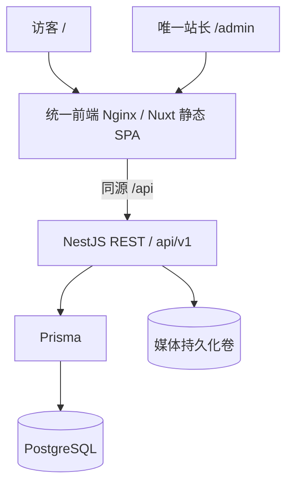

# 架构与实现边界

## 工程与边界

npm workspaces：`apps/backend`、`apps/frontend`、`packages/content`。`apps/frontend` 是唯一 Nuxt 4 / Vue 3 / Pinia 应用，通过 Nuxt 文件路由和布局提供博客 `/` 与 Element Plus 管理工作台 `/admin`；原来的独立博客、管理端工程已合并。`packages/content` 提供共用的 TypeScript 响应类型、安全 Markdown 渲染和日期格式。前端不导入 Prisma；Swagger 提供请求契约，当前响应类型手工维护并通过集成测试核对主流程。

前端 `ssr:false`，`nuxt generate` 输出 `.output/public`。`Dockerfile.frontend` 将静态产物和 Nginx 配置放进一个镜像，Nginx 负责静态文件、SPA 深层路由回退和 `/api/` 反向代理。生产只有 frontend、backend、database 三个常驻服务；migrate/seed 是复用后端镜像的一次性工具，不运行独立代理、管理端或 Nuxt/Nitro 服务。浏览器使用相对地址 `/api/v1`，开发时由 Nuxt 代理到本地后端。

后台只有一个站长账户，数据库唯一表达式索引保证最多一个账户，CHECK 约束固定登录邮箱为 `whoreahri@gmail.com`。没有注册、邮箱修改、角色矩阵、多租户、扩展系统或主题商店。后端不依赖 Sakura，不存页面 HTML；`site_settings` 的 JSONB 配置由前端决定如何展示。

## 数据与发布

表包括 users、admin_sessions、posts、pages、categories、tags、post_categories、post_tags、media、comments、site_settings、moments、photos，以及各内容实体的语言翻译表。数据库列 snake_case，JSON/TS 属性 camelCase；时间以 UTC timestamptz/ISO 8601 传输，博客日期按 Asia/Shanghai 展示。

- 文章、独立页面和瞬间在各语言翻译记录保存 Markdown 原文；渲染在前端运行时完成。
- 每个内容语言版本分别维护 `DRAFT / PUBLISHED / ARCHIVED` 和 publishedAt；公开查询仅允许 PUBLISHED 且 publishedAt <= 当前时间。预约发布通过查询过滤生效，无需队列。
- 首次发布自动填时间；撤回保留原时间，再发布继续使用。显式清空时间并发布会设为当前时间。
- 管理 API 返回 `translations` 数组。PUT 中提交的语言记录按 locale upsert，未提交的另一语言保持不变；共享 slug/封面/分类/标签在逻辑内容记录保存。省略保持不变，null 清空可空字段，空数组清空分类/标签；关联事务失败时整体回滚。
- slug 唯一，可编辑；当前不提供旧 slug 重定向。SEO 阶段再增加重定向记录。
- 列表不返回正文；作者公开字段仅 id/displayName/avatarUrl。密码哈希与邮箱不出现在公开文章中。
- viewCount 保留字段，暂不采集阅读量；commentCount 随审核事务维护，只计通过审核的评论。
- `site`、`homepage` 是公开配置命名空间，使用嵌套 DTO 校验；禁止在配置中存秘密。它们不构成后端主题实体。
- media 是存储对象；photos 是有标题、描述、相册与公开开关的图库条目。

## 双语路由与内容选择

只支持 `zh` 和 `en`。公开页面及 API 均不包含语言路径或 query：页面 `/posts/:slug`，API `/api/v1/public/posts/:slug`。首次访问按浏览器语言选择，footer 选择保存在一年期 `cool_locale` cookie（SameSite=Lax，HTTPS 下 Secure）。API 优先采用该 cookie，再按 Accept-Language 权重协商，最终默认英文。所有本地化公开响应声明 `Vary: Accept-Language, Cookie` 和 `Cache-Control: private, no-store`，避免共享缓存交叉语言。后台界面语言使用同一读者偏好，编辑正文语言保持独立。搜索词 q 与分页 page/pageSize 仍是普通 query 字段。

文章和页面只有一个逻辑 ID/slug、作者/封面和分类标签关联。翻译表用 `(parentId, locale)` 唯一约束保存标题、摘要（文章）、正文及各自发布状态/时间。后台界面语言与编辑器内容语言互相独立；例如英文后台可以编辑中文正文，预览链接与当前内容 tab 一致。草稿按记录与语言保存，切换语言保留未保存提醒。

公开查询先选请求语言的可见版本，再选择另一语言的可见版本。缺少翻译、草稿或未来预约版本不会阻止另一语言已发布内容显示；没有任何可见版本时返回 404。回退不改变 URL 或界面语言，不弹出“缺少翻译”提示；响应 `contentLocale` 和正文 `lang` 标识实际内容语言。列表、搜索、归档、分类/标签过滤与总数都按这一选择后的逻辑记录计算，每个 ID 最多出现一次，不泄漏未发布正文。

瞬间同样按语言发布；分类/标签名称、图库描述和站点展示文案可编辑双语并按可用内容回退。媒体对象、作者身份和文章评论按逻辑内容共享；用户正文和评论不会自动翻译。语言选择进入数据请求及缓存键，避免切换后复用另一语言的旧响应。

这是新项目的完整双语 schema 基线，仅支持新空数据库，不包含旧单语数据迁移或旧公开 URL 兼容跳转。

## API

完整定义见 `/api/openapi.json`，开发环境 Swagger 位于 `/api/docs`。

| 类型       | 路径（前缀 `/api/v1`）                                                                                                        |
| ---------- | ----------------------------------------------------------------------------------------------------------------------------- |
| 公开配置   | `GET /public/site`、`/public/config`                                                                                          |
| 文章发现   | `GET /public/posts`、`/posts/:slug`、`/categories`、`/tags`、`/archives`、`/search`（均在 `/public` 下）                      |
| 其他内容   | `GET /public/pages/:slug`、`/public/moments`、`/public/photos`                                                                |
| 评论       | `GET/POST /public/posts/:slug/comments`                                                                                       |
| 认证       | `GET /admin/auth/status`、`POST /admin/auth/setup`、`POST /admin/auth/login`、`GET /admin/auth/session`、`GET /admin/auth/me` |
| 账户与会话 | `POST /admin/auth/logout`、`POST /admin/auth/revoke-all`、`PUT /admin/auth/profile`、`PUT /admin/auth/password`               |
| 内容管理   | `/admin/posts`、`/admin/pages`、`/admin/moments`、`/admin/photos`、`/admin/categories`、`/admin/tags`                         |
| 媒体       | `GET /admin/media`、`POST /admin/media/upload`、`DELETE /admin/media/:id`、`GET /media/:key`                                  |
| 管理功能   | `GET /admin/overview`、`GET/PUT /admin/settings`、`GET /admin/comments`、`PUT/DELETE /admin/comments/:id`                     |

分页列表返回 `{items,total,page,pageSize}`，pageSize 默认 10、最大 50。文章支持 category/tag slug 和 q；搜索在标题、摘要、Markdown 原文做大小写不敏感匹配，适合个人内容规模。分类/标签公开列表只包含有已发布文章的条目。归档由前端按月分组。

## 认证、上传与评论

固定站长邮箱为 `whoreahri@gmail.com`，不从 `.env` 读取账户邮箱或密码。seed 幂等创建无密码的站长与默认站点配置；登录页通过 `/admin/auth/status` 判断是否首次使用，直接提交 `/admin/auth/setup` 设置至少 6 字符的密码（不限制字符类型或格式），不使用额外初始化密钥。初始化采用事务锁及条件更新，并发请求只允许一个成功；之后 setup 关闭。**新实例应在开放公网前完成首次密码设置。** 新实例使用完整 schema migration，站长身份与会话约束直接在数据库中建立。

密码使用随机盐与 Node scrypt。登录/首次设置同时返回 Bearer Token 和 `csrfToken`，并设置 `cool_session` HttpOnly Cookie；JWT 使用 HS256、固定 issuer/audience，JWT 与 Cookie 均为 15 天有效期。Cookie 使用 `SameSite=Lax`、`Path=/`，生产环境启用 `Secure`，公开部署需要 HTTPS。登录与首次设置各有每分钟 5 次的后端限流，Nginx 也对两个入口限流。

每个 JWT 绑定 `admin_sessions` 记录及用户 authVersion，所有受保护请求都会检查会话是否已撤销。当前退出只撤销该会话；退出全部设备和改密递增 authVersion 并撤销该用户全部会话，同时清除当前 Cookie。改密必须验证当前密码。

浏览器只使用 HttpOnly Cookie，不持久化 Bearer Token；用户资料与 CSRF 值保留在内存，刷新后通过 `/admin/auth/session` 恢复；另一标签页重新登录导致 CSRF 变化时，仅对明确的 CSRF 拒绝刷新会话并重试一次，保留原请求数据。API 的 CORS 固定为 `*`，不允许携带凭据的跨域读取，也不校验 Origin/Fetch Metadata。Cookie 认证的写请求必须附带会话对应的 `X-CSRF-Token`；Cookie 使用 `SameSite=Lax`，登录与首次设置仅接受 `application/json`，拒绝 HTML 表单提交。命令行/API 客户端可使用显式 Bearer Token；错误的 Authorization 头不会回退到 Cookie。认证响应和受保护响应禁止缓存。HTTPS 网关与转发头说明见 [运维说明](operations.md#代理信任与访客限流)。

JSON 请求体限制1MB，ValidationPipe 拒绝未知字段。媒体上传最大8MB，Sharp 解码验证格式与像素数量（最多4000万），旋转/缩放至最大2560像素、转为 WebP，GIF 保留首帧；不接受 SVG/HTML。文件默认直接保存到项目根目录 `./data`（已 Git 忽略）；生产将此宿主机目录 bind mount 到 `/app/data`，媒体不使用命名卷，数据库仍使用 `postgres_data` 命名卷。公开路径为 `/api/v1/media/<uuid>.webp`；删除时检查数据库内容与配置引用。更换存储后端时可以沿用公开 API。

访客评论纯文本，默认待审核，蜜罐字段和每分钟3次限流；只公开审核通过内容。审核事务锁定关联文章，维护正确的评论数。当前限流在单进程内；扩容前再引入 Redis。关闭网站评论后拒绝新评论。

## Sakura 视觉系统

使用本地二次元插画和樱花图标，保留原始图片水印与第三方授权说明。公共布局、卡片与阅读样式均为本项目维护，不再依赖上游编译 CSS 或原主题模板层级。共享 token 管理樱粉、梅紫、淡紫色系与本地字体；公共与 Admin 样式按业务模块分离并以 `html[data-surface]` 隔离。导航、明暗切换和图库弹窗使用 Vue 生命周期管理，原可选波浪作为低透明度横幅装饰保留，尊重减少动画偏好。未引入音乐播放器、Live2D、第三方评论、外部小部件或新的主题框架。

## 管理端

统一 Nuxt 应用中的 `/admin` 路由和 admin 布局，业务组件位于 `apps/frontend/app/features/admin`，使用 Element Plus，自行实现且不依赖 Halo 管理端或后端。所有浏览器可见页面采用 Sakura / 二次元 / 少女风格：樱粉、梅紫、淡紫色系，Ubuntu 字体、本地二次元插画、圆角与线性图标；与博客共用设计变量和本地字体，构建时隔离两种界面的样式。内容、表格与编辑区域保持清晰易读，登录、弹窗、空状态和错误状态延续相同设计。

内容工作台提供真实数据统计、Markdown 编辑预览、图片插入、发布与配置维护。未保存草稿按记录和内容语言存储在 sessionStorage，同一标签页登录后可恢复；保存只确认实际提交的快照，网络请求期间继续写的内容仍保持未保存状态。新建后的路由切换自动接续这些新修改；只有全部修改已保存时才清除草稿。离开编辑器提示未保存修改，登录过期时保留草稿并进入登录页。

## 依赖审计

版本锁在 package-lock.json。Prisma 使用7.x稳定线，Node24；deepmerge-ts/mysql2/js-yaml overrides 修复间接依赖问题，升级时复核是否仍需保留。

`npm run audit` 对所有工作区执行 npm audit，阻断未审查的 high/critical 叶子告警。审计脚本仅精确放行 [GHSA-86w9-cpqp-85rv](https://github.com/advisories/GHSA-86w9-cpqp-85rv)：Nuxt → listhen 开发 HTTPS 的 node-forge 1.4.0 RSA 验签问题，该例外针对锁文件中的 node-forge 版本。当前开发服务不启用 HTTPS，listhen 相关代码用于创建本地证书，Cool 不调用其 RSA 验签；后端运行镜像不安装 Nuxt，前端生产只运行 Nginx 和静态文件，不携带 Nuxt 开发 HTTPS 工具链。此例外不是忽略所有 Nuxt 告警；上游修复后应升级并移除脚本中的 URL 例外。

## 前端视觉模块

共享 `assets/tokens.css` 定义 Sakura 颜色、文字和表面。公共样式由 `blog/base.css`（基础控件与状态）、`shell.css`（导航、横幅、抽屉和页脚）、`content.css`（文章、阅读、归档、分类、瞬间和图库）组成；原主题及补丁层已删除。Admin 样式按 shell/workspace/editor/login 分离并清除被后续同选择器覆盖的声明。PostCSS 为每个表面添加低优先级作用域，避免 SPA 切换或传送弹层污染另一表面。`useReadingShell` 管理阅读导航的焦点、滚动和生命周期；内容组件只负责其展示。

公共页与 Admin 外层使用 `SakuraPattern` SVG 平铺背景。组件支持 `shapes`（heart/star/dot）、`size`、`spacing`、`colors`、`opacity`、`seed`；默认 seed 保持图案稳定。SVG pattern 使用错行网格和跨边界副本，元素数量固定，不随页面长度增长。正文面板保留实色表面，公共深色背景独立调整透明度。页脚继续显示原始 `/sakura/images/footer/sakura.svg`。
